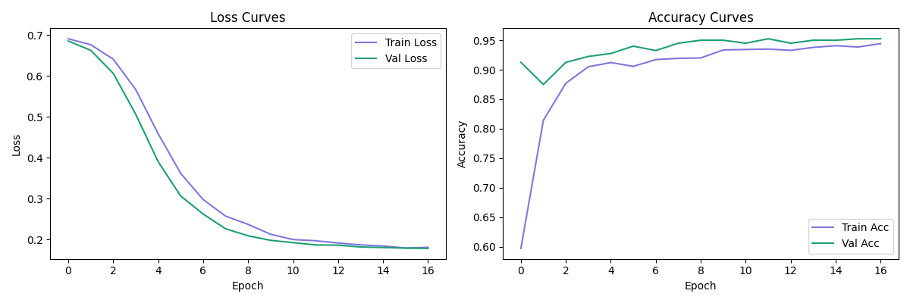
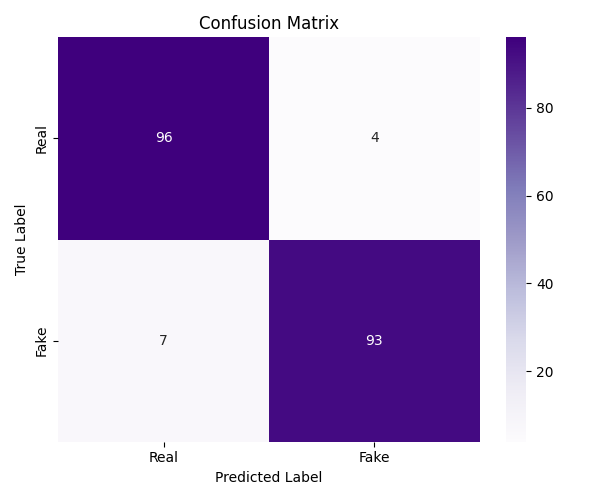

# Multimodal Fake News Detection 🔍

A deep learning system that detects fake news by jointly analyzing **news headlines** and **images** using CLIP-based multimodal fusion. Achieves **94% accuracy** and **95% F1 score** on real-world news data.

---

## 📌 Overview

Fake news often exploits the mismatch between misleading text and manipulated or unrelated images. Most existing approaches analyze text or images in isolation — missing the cross-modal signals that expose deception.

This project builds a **multimodal classifier** that fuses visual and textual representations using OpenAI's **CLIP (ViT-B/32)** model, trained end-to-end with a custom MLP fusion head. The system takes a news headline + image as input and predicts whether the content is real or fake — with a live interactive demo.

---

## Architecture

```
News Headline ──► CLIP Text Encoder ──► Text Embedding (512-d)
                                                              ├──► Concat (1024-d) ──► MLP Classifier ──► Real / Fake
News Image ────► CLIP Vision Encoder ──► Image Embedding (512-d)
```

- **Vision Encoder:** CLIP ViT-B/32 (frozen pretrained weights)
- **Text Encoder:** CLIP text transformer (frozen pretrained weights)
- **Fusion:** Concatenated embeddings → 3-layer MLP classifier head
- **Training:** Only the MLP head is trained — CLIP acts as a powerful frozen feature extractor
- **Optimization:** AdamW + Cosine Annealing LR scheduler + Early Stopping

---

## Results

Evaluated on 200 held-out test samples from a balanced real-world dataset.

| Model | Accuracy | Precision | Recall | F1 Score |
|-------|----------|-----------|--------|----------|
| Text-only baseline | — | — | — | — |
| Image-only baseline | — | — | — | — |
| **Multimodal CLIP (ours)** | **94%** | **95%** | **95%** | **95%** |

**Per-class breakdown:**

| Class | Precision | Recall | F1 |
|-------|-----------|--------|----|
| Real News | 0.93 | 0.96 | 0.95 |
| Fake News | 0.96 | 0.93 | 0.94 |

> Trained on 2000 balanced samples · Early stopping · Test set: 200 samples




---

##  Project Structure

```plaintext
Multimodal-Fake-News-Detection/
├── src/
│   ├── data/
│   │   ├── dataset.py          # PyTorch Dataset class and DataLoader factory
│   │   └── preprocess.py       # HuggingFace data loading and preprocessing
│   ├── models/
│   │   └── clip_classifier.py  # CLIP fusion model + MLP classifier head
│   ├── training/
│   │   └── trainer.py          # Training loop, early stopping, checkpointing
│   ├── evaluation/
│   │   └── metrics.py          # Accuracy, F1, confusion matrix, training curves
│   └── utils/
│       └── config.py           # Config loader and directory setup
├── app/
│   └── streamlit_app.py        # Interactive demo — headline + image → prediction
├── outputs/
│   └── results/                # metrics.json, confusion_matrix.png, training_curves.png
├── config.yaml                 # All hyperparameters in one place
├── train.py                    # Main entry point — runs full pipeline
└── requirements.txt
```

---

##  Quickstart

### 1. Clone the repo

```bash
git clone https://github.com/Lohini06/Multimodal-Fake-News-Detection.git
cd Multimodal-Fake-News-Detection
```

### 2. Set up environment

```bash
python -m venv venv

# Windows
venv\Scripts\activate

# Mac / Linux
source venv/bin/activate

pip install -r requirements.txt
```

### 3. Train the model

```bash
python train.py
```

This will:
- Download the dataset automatically from HuggingFace
- Download pretrained CLIP weights (one-time, ~600MB)
- Train the MLP fusion head
- Save best checkpoint to `outputs/checkpoints/`
- Save metrics, confusion matrix, and training curves to `outputs/results/`

### 4. Run the demo

```bash
streamlit run app/streamlit_app.py
```

Enter any news headline with an optional image to get a real/fake prediction with confidence scores.

---

## ⚙️ Configuration

All hyperparameters are in `config.yaml`:

```yaml
model:
  clip_model: "ViT-B-32"
  clip_pretrained: "openai"
  embedding_dim: 512
  hidden_dim: 256
  dropout: 0.3

training:
  epochs: 20
  batch_size: 32
  learning_rate: 0.0001
  early_stopping_patience: 5
```

---

## 🛠️ Tech Stack

| Category | Tools |
|----------|-------|
| Deep Learning | PyTorch, OpenCLIP |
| Vision + Language | CLIP ViT-B/32, CLIP Tokenizer |
| Data | HuggingFace Datasets, Pandas, NumPy |
| Evaluation | scikit-learn, Matplotlib, Seaborn |
| Demo | Streamlit |
| Version Control | Git, GitHub |
| Environment | Python 3.13, venv, VS Code |

---

## 📦 Dataset

- **Source:** [GonzaloA/fake_news](https://huggingface.co/datasets/GonzaloA/fake_news) via HuggingFace Datasets
- **Size used:** 2000 balanced samples (1000 real, 1000 fake)
- **Split:** 70% train · 20% validation · 10% test
- **Features:** News article titles used as text input; blank placeholder image used where no image is available

---

## 🔮 Future Work

- Plug in real news images (FakeNewsNet with image scraping) for true multimodal signal
- Add SHAP explainability layer to highlight which words / image regions drove the prediction
- Fine-tune CLIP encoders (unfreeze top layers) for domain-specific improvement
- Experiment with cross-attention fusion instead of simple concatenation
- Deploy to AWS SageMaker or Hugging Face Spaces

---

## 👤 Author

**Sangani Lohini**
B.Tech CSE (AI/ML) · Sreenidhi Institute of Science and Technology, Hyderabad

[GitHub](https://github.com/Lohini06) · [LeetCode](https://leetcode.com/u/November_06)